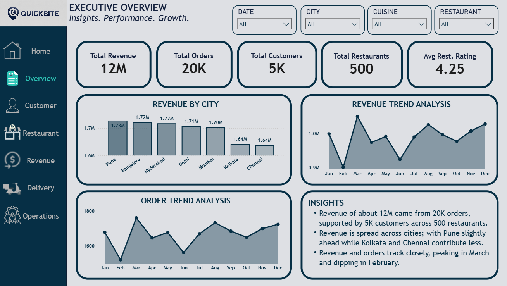
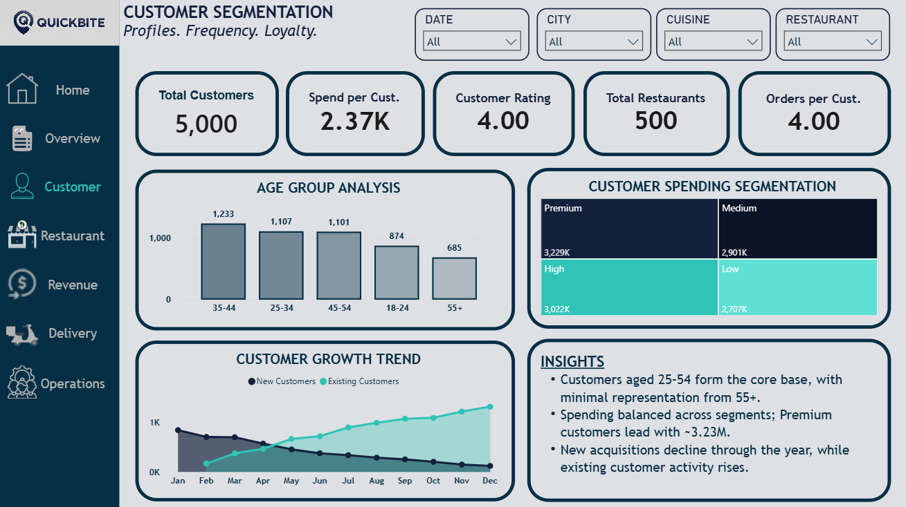
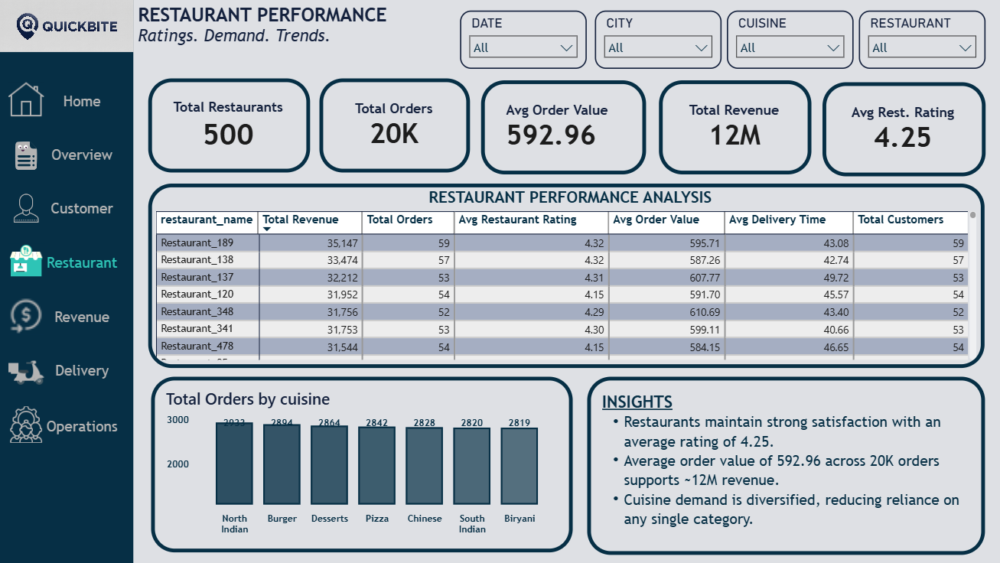
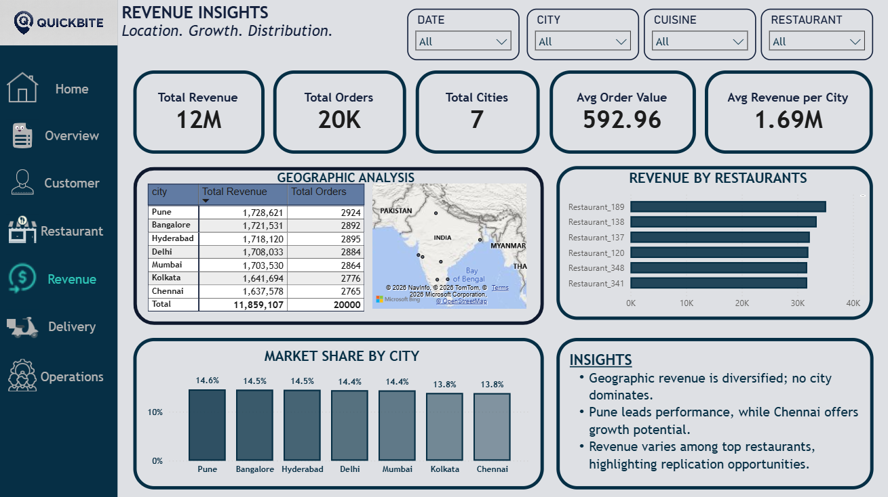
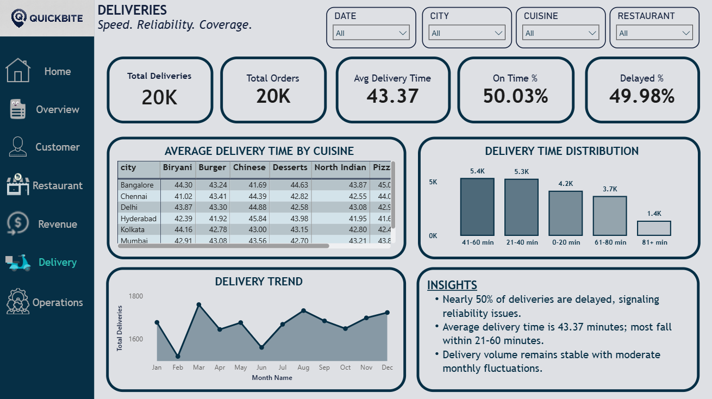
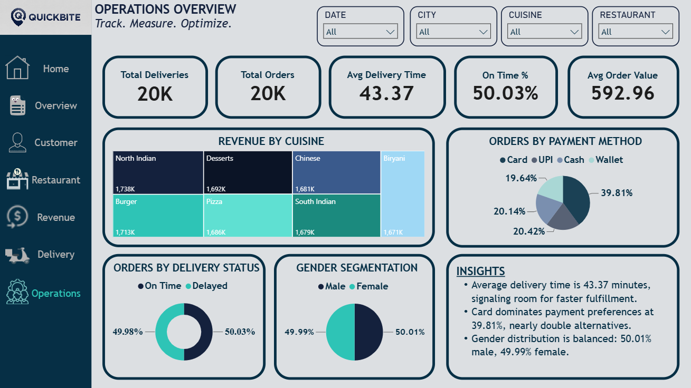

# 🍔 QuickBite Food Delivery Analytics Report

An interactive Power BI dashboard that provides comprehensive business intelligence for a fictional food delivery platform, **QuickBite**. The project analyzes revenue, customer behavior, restaurant performance, delivery operations, and executive KPIs to support data-driven decision-making.

---

## 📌 Project Overview

This project was developed using **Power BI** to transform raw food delivery transaction data into meaningful business insights.

The dashboard enables stakeholders to:

- Monitor overall business performance
- Analyze customer demographics and spending behavior
- Evaluate restaurant performance
- Track revenue across cities and cuisines
- Measure delivery efficiency
- Monitor operational performance using interactive visualizations

---

## 📊 Report Pages

### Executive Overview
Provides a high-level summary of business performance through key performance indicators and trend analysis.

**Highlights**
- Total Revenue
- Total Orders
- Total Customers
- Total Restaurants
- Average Restaurant Rating
- Revenue by City
- Revenue Trend Analysis
- Order Trend Analysis

---

### Customer Segmentation

Analyzes customer demographics, spending patterns, and customer acquisition trends.

**Highlights**
- Customer Distribution by Age Group
- Customer Spending Segmentation
- New vs Existing Customer Trend
- Average Spend per Customer
- Average Orders per Customer

---

### Restaurant Performance

Evaluates restaurant efficiency and customer satisfaction.

**Highlights**
- Restaurant Ratings
- Average Order Value
- Restaurant Performance Analysis
- Orders by Cuisine
- Revenue Performance

---

### Revenue Insights

Explores revenue distribution across cities and restaurants.

**Highlights**
- Geographic Revenue Analysis
- Market Share by City
- Revenue by Restaurant
- Revenue KPIs

---

### Delivery Analytics

Measures delivery performance and operational efficiency.

**Highlights**
- Average Delivery Time
- Delivery Time Distribution
- Monthly Delivery Trend
- Delivery Performance by Cuisine

---

### Operations Dashboard

Provides operational insights into customer transactions and delivery performance.

**Highlights**
- Revenue by Cuisine
- Orders by Payment Method
- On-Time vs Delayed Deliveries
- Operational KPIs

---

## 📈 Key KPIs

- Total Revenue
- Total Orders
- Total Customers
- Total Restaurants
- Average Order Value
- Average Spend per Customer
- Average Restaurant Rating
- Average Delivery Time
- On-Time Delivery Percentage

---

## ⚙️ Features

- Interactive slicers
- Drill-through pages
- Dynamic DAX measures
- Cross-filtering across visuals
- Executive summary insights
- Responsive dashboard layout
- Consistent dashboard theme
- Multi-page navigation

---

## 🛠️ Tools & Technologies

- Microsoft Power BI
- Power Query
- DAX (Data Analysis Expressions)
- CSV Dataset

---

## 📂 Dataset

The project uses a synthetic food delivery dataset containing approximately **20,000 transactions**, including:

- Orders
- Customers
- Restaurants
- Cities
- Cuisine Types
- Revenue
- Delivery Times
- Payment Methods
- Ratings

---

## 📸 Dashboard Preview

### Executive Overview



---

### Customer Segmentation



---

### Restaurant Performance



---

### Revenue Insights



---

### Delivery Analytics



---

### Operations Dashboard



---

## 📁 Repository Structure

```
QuickBite-PowerBI-Dashboard
│
├── PowerBI
│   └── QuickBite Dashboard.pbix
│
├── Dataset
│   └── swiggy_portfolio_dataset_20000_rows.csv
│
├── Images
│   ├── executive-overview.png
│   ├── customer-segmentation.png
│   ├── restaurant-performance.png
│   ├── revenue-insights.png
│   ├── delivery-dashboard.png
│   └── operations-dashboard.png
│
└── README.md
```

---

## 📌 Key Business Insights

- Revenue is well distributed across all operating cities.
- Customer spending is diversified across multiple spending segments.
- Restaurant ratings remain consistently high across the platform.
- Delivery performance highlights opportunities to improve on-time deliveries.
- Cuisine demand remains balanced, reducing reliance on a single category.

---

## 🚀 Future Improvements

- Live database connectivity
- Real-time dashboard refresh
- Forecasting using Power BI AI visuals
- Customer lifetime value analysis
- Profitability dashboard
- Geographic mapping enhancements

---

## 👤 Author

**Palmer**

Power BI • Data Analytics • Business Intelligence

---